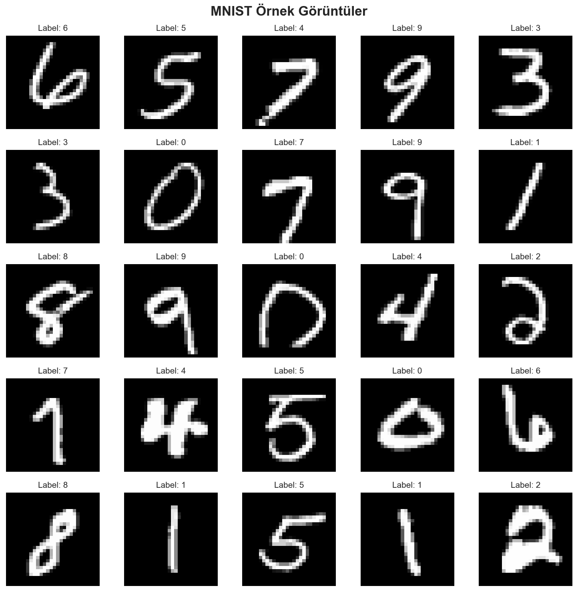
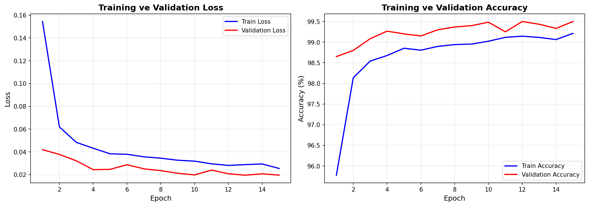
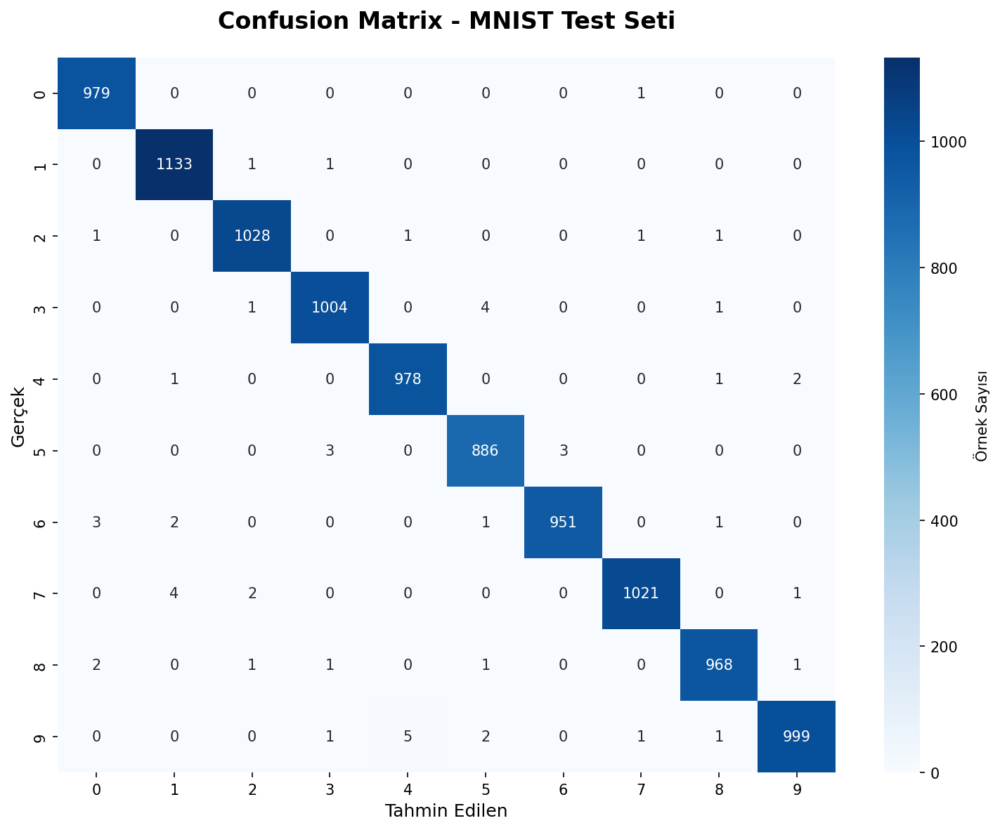
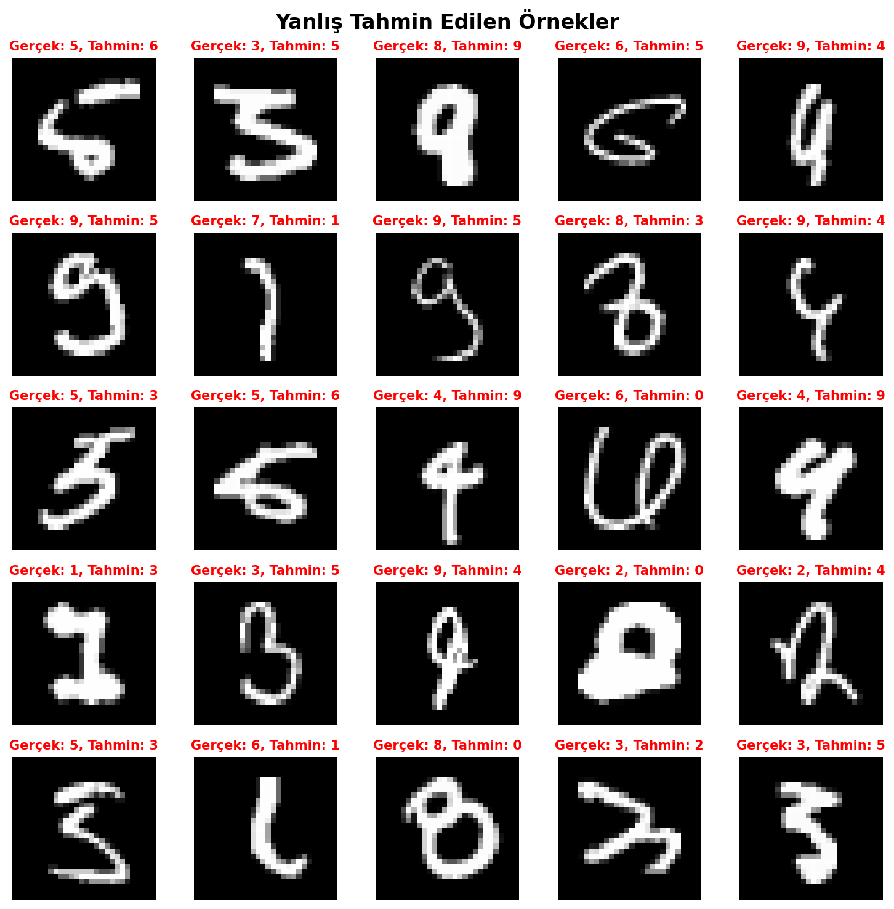

# 🖊️ Handwritten Digit Recognition (MNIST)

[](https://www.python.org/)
[](https://pytorch.org/)
[](https://developer.nvidia.com/cuda-toolkit)
[](LICENSE)

A deep learning project for recognizing handwritten digits (0-9) from the MNIST dataset using PyTorch. This project implements a custom Convolutional Neural Network (CNN) architecture inspired by LeNet-5, achieving state-of-the-art performance with **99.47% test accuracy**.

## 🎯 Project Overview

This project demonstrates a complete deep learning pipeline for image classification, from data exploration to model deployment. The model successfully classifies handwritten digits with high accuracy using a modern CNN architecture with BatchNorm and Dropout regularization techniques.

**Key Highlights:**
- ✨ **99.47% test accuracy** on MNIST test set
- 🏗️ Custom CNN architecture with 871,530 trainable parameters
- 📊 Comprehensive EDA (Exploratory Data Analysis) with visualizations
- 🔧 Well-structured, modular codebase following best practices
- 📈 Training history tracking with early stopping
- 🎨 Professional visualizations and evaluation metrics

## 📊 Results

### Performance Metrics

| Metric | Value |
|--------|-------|
| **Test Accuracy** | **99.47%** |
| Validation Accuracy | 99.43% |
| Best Epoch | 13 |
| Total Parameters | 871,530 |
| Training Time | ~15 epochs |

**Note:** All classes achieved F1-score ≥ 0.99, demonstrating excellent performance across all digit classes (0-9).

### Classification Report Summary

- **Precision:** 0.99 (macro avg)
- **Recall:** 0.99 (macro avg)
- **F1-Score:** 0.99 (macro avg)
- **Support:** 10,000 test samples

## 🖼️ Visualizations

### Sample Images

*25 randomly selected samples from the MNIST training dataset*

### Training History

*Training and validation loss/accuracy curves showing model convergence*

### Confusion Matrix

*Confusion matrix showing classification performance across all 10 digit classes*

### Per-Class Accuracy

*Accuracy breakdown for each digit class (0-9)*

### Misclassified Examples

*Visualization of incorrectly classified samples for error analysis*

## 🏗️ Model Architecture

The model uses a custom CNN architecture inspired by LeNet-5 with modern improvements:

### Architecture Overview

| Layer | Type | Output Shape | Parameters |
|-------|------|--------------|------------|
| **Conv Block 1** | Conv2d → BatchNorm → ReLU | (32, 28, 28) | 9,632 |
| | Conv2d → BatchNorm → ReLU | (32, 28, 28) | 9,248 |
| | MaxPool2d → Dropout2d | (32, 14, 14) | - |
| **Conv Block 2** | Conv2d → BatchNorm → ReLU | (64, 14, 14) | 18,496 |
| | Conv2d → BatchNorm → ReLU | (64, 14, 14) | 36,928 |
| | MaxPool2d → Dropout2d | (64, 7, 7) | - |
| **Fully Connected** | Flatten → Linear | (256) | 803,072 |
| | BatchNorm1d → ReLU → Dropout | (256) | 512 |
| | Linear | (10) | 2,570 |

**Total Parameters:** 871,530

### Key Features
- **Batch Normalization:** Stabilizes training and improves convergence
- **Dropout Regularization:** Prevents overfitting (0.25 for conv layers, 0.5 for FC)
- **Modern Architecture:** LeNet-5 inspired with contemporary improvements

## 📁 Project Structure

```
Handwritten-Digit-Recognition/
├── configs/
│   └── config.yaml          # Configuration file
├── data/
│   └── MNIST/               # MNIST dataset (auto-downloaded)
├── notebooks/
│   └── exploration.ipynb    # EDA notebook
├── outputs/
│   ├── figures/             # Visualization outputs
│   └── models/               # Trained model checkpoints
├── src/
│   ├── data_loader.py        # Data loading utilities
│   ├── model.py              # CNN model architecture
│   ├── train.py              # Training script
│   ├── evaluate.py           # Evaluation script
│   └── utils.py              # Utility functions
├── requirements.txt          # Python dependencies
└── README.md                 # This file
```

## 🚀 Quick Start

### Prerequisites

- Python 3.11.0
- CUDA 12.4+ (for GPU acceleration)
- NVIDIA GPU with CUDA support (recommended)

### Installation

1. **Clone the repository**
   ```bash
   git clone <repository-url>
   cd Computer-Vision/Handwritten-Digit-Recognition
   ```

2. **Create virtual environment**
   ```bash
   python -m venv venv
   # Windows
   venv\Scripts\activate
   # Linux/Mac
   source venv/bin/activate
   ```

3. **Install dependencies**
   ```bash
   pip install -r requirements.txt
   ```

### Usage

**Training:**
```bash
python src/train.py
```

**Evaluation:**
```bash
python src/evaluate.py
```

**EDA Notebook:**
```bash
jupyter notebook notebooks/exploration.ipynb
```

## 🛠️ Technologies Used

-  - Deep learning framework
-  - Numerical computing
-  - Data visualization
-  - Statistical visualization
-  - Machine learning utilities
-  - Interactive notebooks

## 📈 Training Details

### Hyperparameters

| Parameter | Value |
|-----------|-------|
| Epochs | 15 |
| Batch Size | 64 |
| Learning Rate | 0.001 |
| Optimizer | Adam |
| Weight Decay | 0.0001 (L2 regularization) |
| Loss Function | CrossEntropyLoss |
| Early Stopping Patience | 5 epochs |

### Training Configuration

- **Data Split:** 90% train, 10% validation
- **Data Augmentation:** None (baseline model)
- **Normalization:** Mean=0.1307, Std=0.3081 (MNIST standard)
- **Device:** CUDA (GPU acceleration)

### Training Process

The model was trained with:
- Early stopping to prevent overfitting
- Best model checkpoint saving based on validation loss
- Progress tracking with tqdm
- Comprehensive logging and visualization

## 📝 Key Learnings

1. **Architecture Design:** Modern CNN architectures with BatchNorm and Dropout can achieve excellent performance even on relatively simple datasets like MNIST.

2. **Data Exploration:** Comprehensive EDA helps understand data distribution, identify potential issues, and guide model design decisions.

3. **Regularization:** Proper use of BatchNorm and Dropout significantly improves generalization and prevents overfitting.

4. **Evaluation:** Detailed evaluation metrics (confusion matrix, per-class accuracy) provide insights beyond overall accuracy, helping identify model weaknesses.

5. **Code Organization:** Modular code structure with separate modules for data loading, model definition, training, and evaluation improves maintainability and reusability.

## 📄 License

This project is licensed under the MIT License - see the LICENSE file for details.

---

**Note:** This project is part of an AI Portfolio showcasing various machine learning and deep learning projects. For more projects, visit the main repository.

